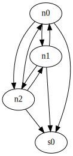

# Node Ranking

## Problem

The problem is to detect sensors, crawlers, other researchers and law enforcement in P2P botnets using different metrics on graphs.
P2P botnets can be modeled as a directed graph `G = (V, E)`, where each vertex represents a node in the botnet and edges represent neighbourhood connections between nodes.
These are hard to monitor due to the missing central authority and must be mapped over time to get an image of the size and members of the botnet.
In the scope of this project, we try to find sensors by ranking nodes in the graph using different graph-ranking algorithms:

* PageRank:
    The Page Rank algorithm is the same algorithm Google uses to estimate the importance of a website by the amount of receiving links from other websites [^pagerank].
    The output of the algorithm is a probability distribution, that a person clicking on links will eventually arrive at any particular page.
    It is recursively defined by the number of incoming links from another website and their own rank resulting in a high rank for a website that many other pages with high rank point to.

    Similar to botnets, the relation between websites and hyperlinks can be modeled as a directed graph with websites as nodes and hyperlinks as edges.
    The Page Rank is a value in the range $$[0.0,1.0]$$. The values are determined based on the predecessors and their respective ranks.
    Therefore we can calculate a so called $$edge-weight_v = PR_v \|succ_v| which will be distributed over all edges of node v resulting in the Page Rank value of a node being the sum of the edge-weights of all its predecessors.

    Nodes in the graph are ranked depending on their incoming and outgoing degree.

    With `rank(v)` being the current rank of the vertex `v`, `pred(v)` being the predecessors of `v` and `succ(v)` being the successors of `v` and a freely choosable `dampingFactor` (TODO), PageRank for `v` is defined as

    

    Damping Factor:

    The Page Rank theory is based on an imaginary surfer, traversing randomly through websites via links.
    The damping factor describes the probability, that the person clicking on links will continue at any step.
    In our implementation of the Page Rank algorithm we don't have to take into account that there is a probability that nodes won't communicate with each other.
    Because of that the damping Factor can be set to 1.

    In a P2P botnet, a bot that is known by many bots has a higher rank because of the amount of predecessors. The longer a bot is in a botnet the bigger its popularity. Sensors are among the most responsive nodes in a botnet.
    Therefore they cannot be distinguished from other popular nodes. However, the edge-weights on outgoing edges should differ significantly between sensor nodes because they have none or few outgoing edges.

* SensorRank:
    Using the original Page Rank algorithm is not effective in P2P botnets because of churn [^recon].
    Unpopular bots may receive a high edge-weight if it has few high-ranked predecessors in combination with very few successors.
    Therefore in the Sensor Rank algorithm we normalize the edge-weight of a node v by multiplying it with the fraction of predecessors over the total population.

    

    The Sensor Rank represents the fraction of a bot's Page Rank that is equally distributed among its neigbours.

* Sensor Buster:
    Sensor Buster utilizes the Strongly Connected Component (SCC) connectivity metric [^sensorbuster].
    P2P botnets want a strong connectivity between their bots to prevent segmentation.
    As a result a main SCC is formed.
    A sensor would not be part of this main SCC because it will not have any bots as its successors and because of that no path from the sensor back to the SCC.
    Therefore, all nodes that are not included in the main SCC are most likely sensors.

    

    While monitoring a P2P botnet requires the sensor to be part of the network, at the same time one does not want to support the network by performing any malicious activity (e.g. DDOS, sending spam, ...).
    Therefore sensors will accept incoming connections but neither execute commands by the botmaster, nor reply accurately to neighbourhood list requests.
    This behaviour results in the disconnected graph component.

## Existing System: BMS

The Botnet Monitoring System (BMS) is a platform to crawl and monitor P2P botnets and building statistics over time [^bms].
Currently the following botnets are being observed:

* DDG: a cryptocurrency mining botnet (Monero), mostly aimed at database servers [^ddg] [^ddg_netlab].
* Hajime: IoT botnet, targeting mostly the same unsecured/badly secured IoT devices as Mirai [^hajime]
* Hide 'n' Seek: IoT devices and misconfigured database servers (e.g. MongoDB, CouchDB), cryptocurrency mining [^hns]
* Mozi: IoT, DDoS, data exfiltration [^mozi]
* Sality: Windows, file infector, spam, proxy, data exfiltration, DDoS [^sality]

Our solution to the problem had to be integrated into BMS to be able build a network graph to perform analysis on.

## Implementation

BMS contains many different, independent tasks, that perform analysis on the collected data.
These tasks are implemented as Docker containers that can read and write from the central PostgreSQL/Timescale database.
We implemented the node ranking as a scheduler that runs once a hour in Python.
Python was chosen since it is already used by other tasks in BMS.

One of the system's tables called `bot_edges` contains each known edge in the botnet graph consisting of IP address, port and bot ID (if available) of the source and destination bots as well as the time,
when the edge has been found.
This table allows to build the network graph for a defined time frame.

To calculate the ranking, we look at the `bot_edges` in time buckets of one hour, build the graph of the network, using the NetworkX Python library [^nx].
All implemented ranking algorithms are applied to the graph and the results are persisted.
Only the top x% or y nodes (both of which are configurable) of the ranked nodes are persisted to prevent the database from getting too big, since it would effectively double the amount of space needed.

### Considerations When Implementing

For testability, purity and extensibility, we implemented the ranking algorithm independent of the actual database schema.
The input is a list of edges which can be loaded from the database but also from a file or be created programmatically, which we take advantage of, when implementing unit tests.

### Testing and Verification of Results

Some unit tests were implemented so we could verify the result of the ranking algorithms, where the input and expected output are known:

* A complete graph was generated and fake sensor nodes with only incoming edges were inserted into the graph. The ranking algorithms are then executed on the graph and we checked if the fake sensor was found.
* Inputs for which the expected result is known were generated and used to test the algorithms
* Since some other crawlers and sensors were known, we used production data to verified, that already well known sensors were found by our implementation

### Failed Attempts and Problems

While the ranking algorithms itself were quite straight-forward to implement, performance issues and memory usage were of concern.
Performing the analysis via SQL and materialized views in the database itself did not work or were dropped before testing, since the analysis itself is to complex to perform in SQL and would be hard to test.
To limit round-trips between database and code, a LRU cache was used to cache the loaded edges, since these can be considered immutable and only need to be loaded once.

TODO: bots per hour

Since BMS monitors up to XXX bots per hour, we decided to limit the amount of ranked/detected peers to persist.

Other small problems included `INSERT` performance with could be improved by batching.

## References

[^recon]: [Reliable Recon in Adversarial Peer-to-Peer Botnets](https://doi.org/10.1145/2815675.2815682) (Andriesse, Dennis and Rossow, Christian and Bos, Herbert)
[^sensorbuster]: [SensorBuster: On Identifying Sensor Nodes in P2P Botnets](https://doi.org/10.1145/3098954.3098991) (Karuppayah, Shankar and Böck, Leon and Grube, Tim and Manickam, Selvakumar and Mühlhäuser, Max and Fischer, Mathias)
[^pagerank]: [The PageRank Citation Ranking: Bringing Order to the Web](http://ilpubs.stanford.edu:8090/422/1/1999-66.pdf) (Page, Lawrence and Brin, Sergey and Motwani, Rajeev and Winograd, Terry)
[^bms]: [Poster: Challenges of Accurately Measuring Churn in P2P Botnets](https://dl.acm.org/doi/10.1145/3319535.3363281) (Böck, Leon and Karuppayah, Shankar and Fong, Kory and Mühlhäuser, Max and Vasilomanolakis, Emmanouil)
[^nx]: [NetworkX: Network Analysis in Python](https://networkx.org/)
[^ddg]: [DDG (Malware Family)](https://malpedia.caad.fkie.fraunhofer.de/details/elf.ddg) (Fraunhofer-Institut für Kommunikation, Informationsverarbeitung und Ergonomie FKIE)
[^ddg_netlab]: [DDG: A Mining Botnet Aiming at Database Servers](https://blog.netlab.360.com/ddg-a-mining-botnet-aiming-at-database-servers/) ([https://netlab.360.com/](Network Security Research Lab at 360))
[^hajime]: [Measurement and Analysis of Hajime, a Peer-to-peer IoT Botnet](https://par.nsf.gov/servlets/purl/10096257) (Herwig, Stephen and Harvey, Katura and Hughey, George and Roberts, Richard and Levin, Dave and University of Maryland and Max Planck Institute for Software Systems (MPI-SWS))
[^hns]: [Hide ‘N Seek botnet continues infecting devices with default credentials, building a P2P network and more](https://blog.avast.com/hide-n-seek-botnet-continues) (Avast)
[^mozi]: [Mozi, Another Botnet Using DHT](https://blog.netlab.360.com/mozi-another-botnet-using-dht/) (Turing, Alex and Wang, Hui)
[^sality]: [Sality: Story of a Peer-to-Peer Viral Network](https://web.archive.org/web/20120403180815/http://www.symantec.com/content/en/us/enterprise/media/security_response/whitepapers/sality_peer_to_peer_viral_network.pdf) (Falliere, Nicolas)
